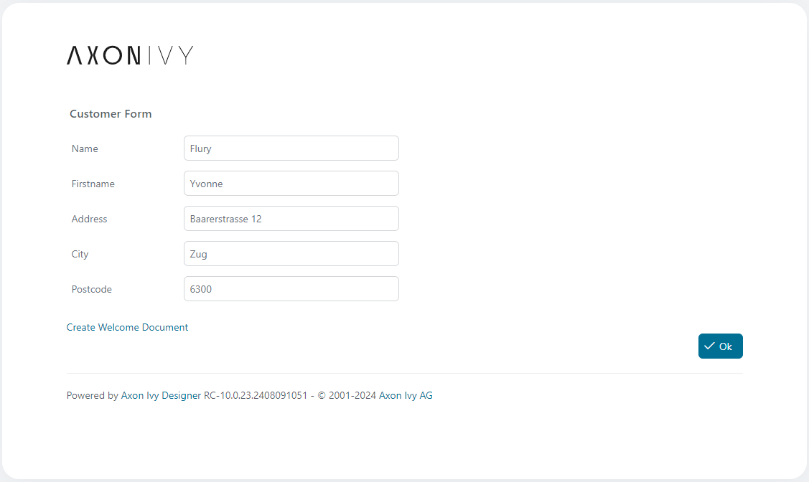
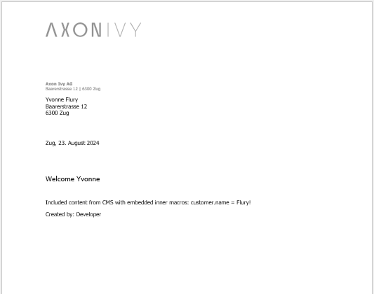

<!--
Dear developer!     

When you create your very valuable documentation, please be aware that this Readme.md is not only published on github. This documentation is also processed automatically and published on our website. For this to work, the two headings "Demo" and "Setup" must not be changed
-->

# RTF Factory

The RTF Factory is an easy document generator that expands document templates in rft format with process data and ivy macro functions.
Rtf document templates can be created using MS Word for example. Simply use ivy macros as placeholders in the document.

A process data attribute can be inserted as follows:  
```
<%=in.customer.name%>
```
Content objects from the CMS can be expanded with a macro that calls the cms.co function  
```
<%=ivy.cms.co("/labels/greeting")%>     
```


## Demo

The RTF Factory provides a single method to generate and download a document. You will usually call this method in a user task.
The document templates can be managed in the CMS or somewhere in the files system. 



The complete script fragment that loads a template and calls the expander

```
import ch.ivyteam.ivy.RtfFactory.ExportFromCms;
import ch.ivyteam.ivy.RtfFactory.RtfExpander;
RtfExpander.sendExpandedRtfFile(ExportFromCms.export("my-document-template", "rtf"), in);
```

The resulting sample document




