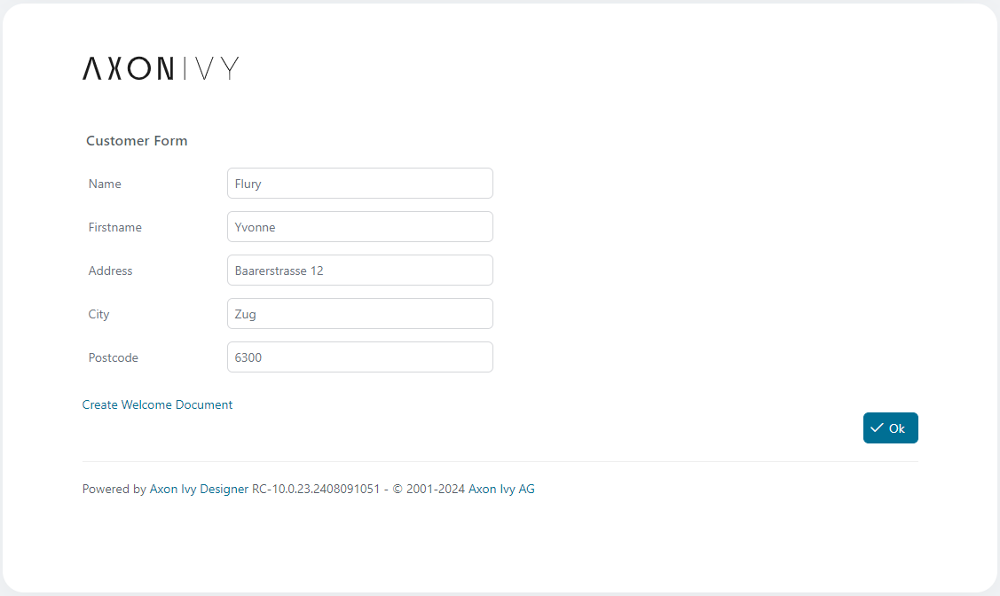
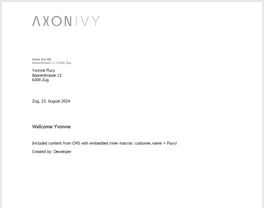

<!--
Dear developer!     

When you create your very valuable documentation, please be aware that this Readme.md is not only published on github. This documentation is also processed automatically and published on our website. For this to work, the two headings "Demo" and "Setup" must not be changed
-->

# RTF Factory

Die RTF Factory ist ein einfacher Dokumentgenerator, der Dokumentvorlagen im
RTF-Format mit Prozessdaten und Ivy-Makrofunktionen erweitert.
RTF-Dokumentvorlagen können beispielsweise mit MS Word erstellt werden.
Verwenden Sie einfach Ivy-Makros als Platzhalter im Dokument.

Ein Prozessdatenattribut kann wie folgt eingefügt werden:
```
<%=in.customer.name%>
```
Inhaltsobjekte aus dem CMS können mit einem Makro erweitert werden, das die
Funktion cms.co aufruft.
```
<%=ivy.cms.co("/labels/greeting")%>     
```


## Demo

Die RTF Factory bietet eine einzige Methode zum Generieren und Herunterladen
eines Dokuments. Diese Methode wird in der Regel in einer Benutzeraufgabe
aufgerufen. Die Dokumentvorlagen können im CMS oder an einem beliebigen Ort im
Dateisystem verwaltet werden.



Das vollständige Skriptfragment, das eine Vorlage lädt und den Expander aufruft

```
import ch.ivyteam.ivy.RtfFactory.ExportFromCms;
import ch.ivyteam.ivy.RtfFactory.RtfExpander;
RtfExpander.sendExpandedRtfFile(ExportFromCms.export("my-document-template", "rtf"), in);
```

Das resultierende Beispieldokument




